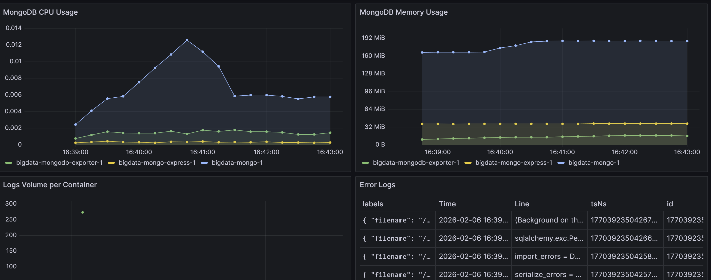
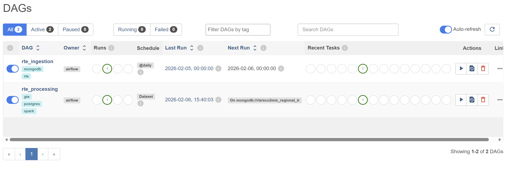
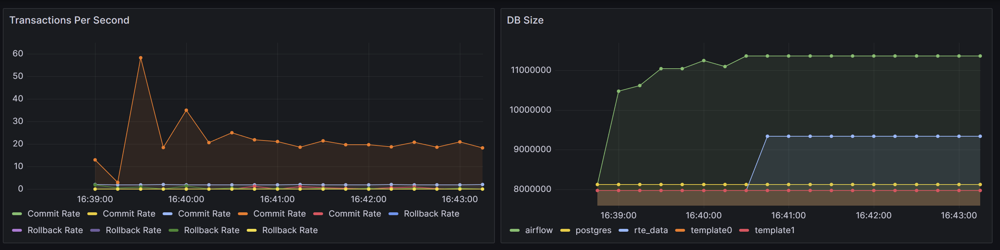

# Pipeline de Données RTE (Data Lake & Monitoring)

Ce projet implémente un pipeline de données complet : Ingestion (Airflow) -> Datalake (MongoDB) -> Traitement (Spark) -> Stockage Final (PostgreSQL) -> Monitoring (Grafana/pgAdmin).

## 🚀 Démarrage Rapide

### Prerequis

1. Clone le projet
``git clone https://github.com/IMT-Ales/BigData``

1. Avoir le deamon docker de lancé

### Démarrage

Pour lancer toute la stack :

```bash
docker compose up -d
```

Pour arrêter : `docker compose down`.

## 🔄 Fonctionnement du Pipeline

Ce projet orchestre un pipeline ELT (Extract, Load, Transform) complet pour analyser les données énergétiques de RTE :

1.  **Ingestion (Airflow)** : Une DAG Airflow interroge l'API OpenData de RTE tous les jours.
2.  **Data Lake (MongoDB)** : Les données brutes (JSON) sont stockées dans MongoDB. Cela permet de conserver l'historique complet sans perte d'information.
3.  **Transformation (Spark)** : Un job Spark lit les données brutes de Mongo, les nettoie, les agrège (par région et filière), et calcule des métriques clés.
4.  **Stockage Structuré (PostgreSQL)** : Les données raffinées sont insérées dans une table PostgreSQL optimisée pour l'analyse.
5.  **Visualisation (Grafana)** : Des dashboards connectés à Postgres et Loki permettent de suivre les métriques métiers (consommation, production) et techniques (logs, santé des bases).

## 🚀 Guide d'Utilisation

Une fois le `docker compose up -d` effectué, voici comment utiliser et vérifier le pipeline :

### 1. Activer le Pipeline (Airflow)
*   Accédez à l'interface Airflow : [http://localhost:8080](http://localhost:8080)
*   **Login/Mdp** : `airflow` / `airflow`
*   Sur la page d'accueil (DAGs), vous verrez les DAGs (ex: `rte_ingestion_dag`).
*   **Important** : Par défaut, les DAGs sont en "Pause". Cliquez sur le bouton toggle (ON/OFF) à gauche du nom du DAG pour l'activer.
*   Le scheduler lancera automatiquement les tâches selon la planification. Pour forcer une exécution immédiate, cliquez sur le bouton "Play" à droite de la ligne du DAG.





### 2. Vérifier les Données (Grafana & Postgres)

#### Via Grafana (Visualisation)
*   Accédez à Grafana : [http://localhost:3000](http://localhost:3000)
*   **Login/Mdp** : `admin` / `admin`
*   Allez dans le menu **Dashboards**. Vous y trouverez des tableaux de bord pré-configurés pour visualiser les données énergétiques (graphiques de consommation, mix énergétique) ainsi que le monitoring technique.



#### Via PostgreSQL (Accès Direct)
Pour vérifier que les données sont bien arrivées en base :
*   Connectez-vous à la base de données (via pgAdmin ou CLI) :
    *   **Port** : `5433` (attention, c'est 5433 en local pour ne pas confict avec un postges local)
    *   **User/Mdp/DB** : `airflow` / `airflow` / `airflow` (ou `rte_data` selon config)
*   Exécutez la requête SQL suivante :  
    ```sql
    SELECT * FROM public.regional_energy_stats;
    ```
    Vous devriez voir les dernières données agrégées.

## 🛠️ Accès aux Services Techniques

| Service | URL | Login | Mot de passe | Description |
| :--- | :--- | :--- | :--- | :--- |
| **Airflow** | `http://localhost:8080` | `airflow` | `airflow` | Orchestration. |
| **Grafana** | `http://localhost:3000` | `admin` | `admin` | Visualisation. |
| **Postgres** | `localhost:5433` | `airflow` | `airflow` | DB Finale. |
| **Mongo** | `localhost:27017` | `admin` | `password` | Data Lake. |

### Configuration pgAdmin
Si vous utilisez pgAdmin [http://localhost:5050](http://localhost:5050) :
*   **Host Name** : `postgres` (nom du service docker)
*   **Port** : `5432` (port interne docker)
*   **User** : `airflow`

## ✅ Intégration Continue (CI)

Chaque modification du code (Push ou Pull Request sur `main`) déclenche automatiquement un pipeline GitHub Actions défini dans `.github/workflows/ci.yml`.

Ce pipeline assure la qualité et la stabilité du projet via deux jobs principaux :

1.  **Python Checks (Qualité du Code)** :
    *   Installation des dépendances Python.
    *   Analyse statique du code avec **Flake8** pour vérifier le style et détecter les erreurs de syntaxe.

2.  **Docker Build (Validité du Build)** :
    *   Tente de construire l'image Docker de l'application.
    *   Garantit que le `Dockerfile` est valide et que l'image peut être générée sans erreur.

## 🙍‍♂️ Groupes

* Maxence Tourniayre (Xamez)
* Thomas Nalix 
* Rohart Yoann